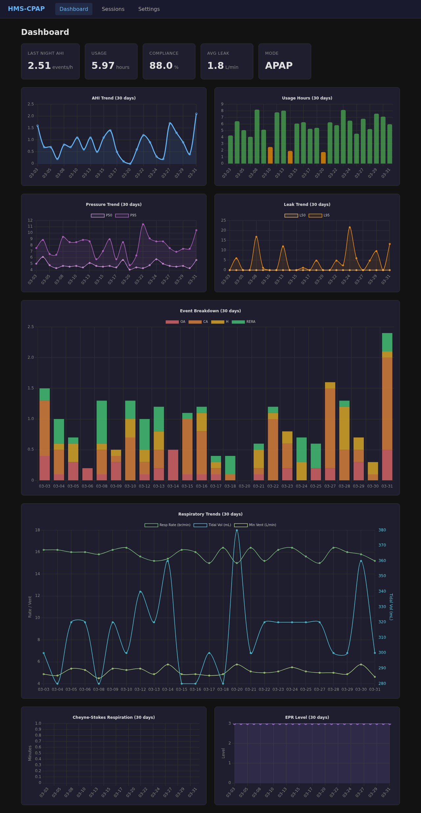
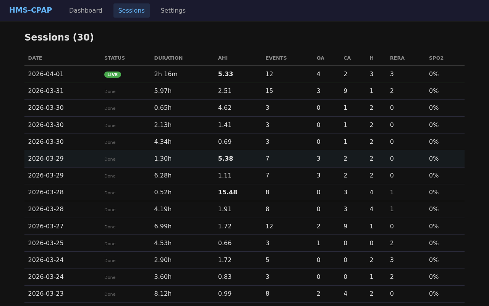
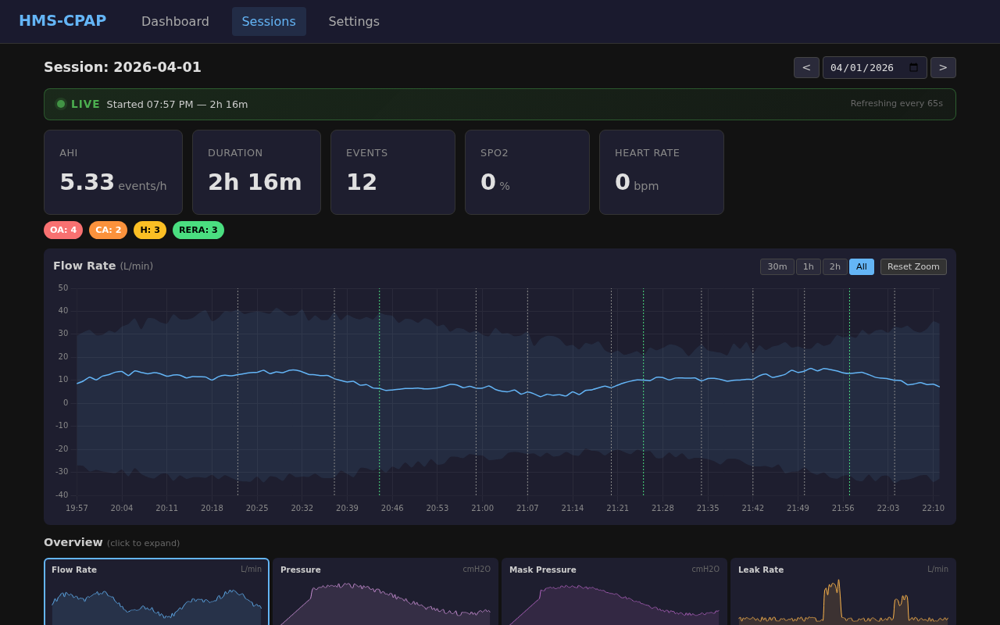
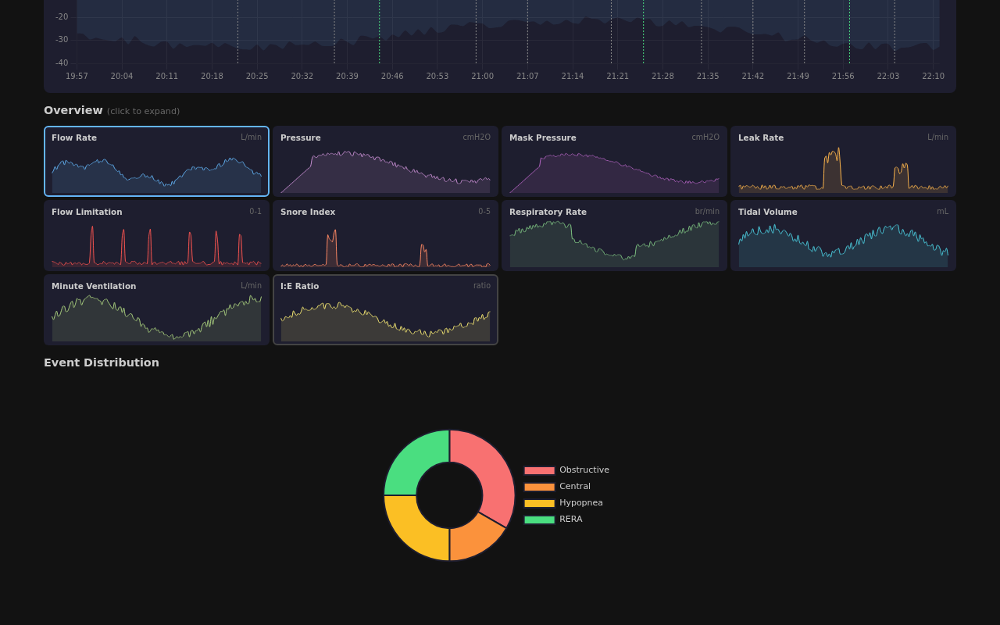
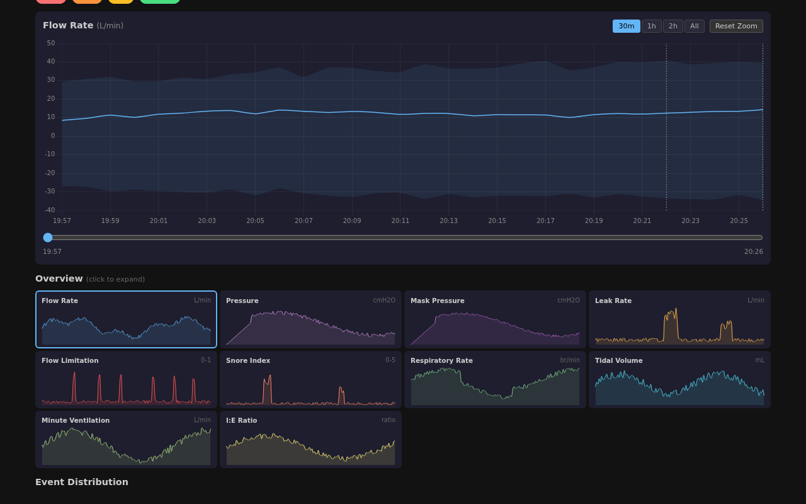

# HMS-CPAP

[](https://opensource.org/licenses/MIT)
[](https://github.com/hms-homelab/hms-cpap/pkgs/container/hms-cpap)
[](https://github.com/hms-homelab/hms-cpap/actions)
[](https://www.buymeacoffee.com/aamat09)

**Lightweight C++ microservice for ResMed CPAP data collection with built-in web dashboard and Home Assistant integration.**

Automatically extracts sleep therapy data from your ResMed AirSense 10/11 CPAP machine, parses EDF files using OSCAR algorithms, and publishes 47+ metrics to Home Assistant via MQTT discovery. Includes a full Angular web UI with OSCAR/SleepHQ-grade charting. Supports three data sources: FYSETC SD WiFi Pro, ezShare WiFi SD with hms-mm bridge, or local filesystem.

## Screenshots

**Dashboard** -- 30-day trends for AHI, usage, pressure, leak, events, respiratory metrics, CSR, and EPR. Mode-aware chart visibility (CPAP/APAP/ASV).



**Sessions** -- Nightly session list with live indicator for in-progress sessions. Click any row for full detail.



**Session Detail** -- Live session view with pulsing LIVE badge, running duration, and real-time metrics. Auto-refreshes every 65s.



**Signal Charts** -- 12 overnight signal charts (flow, pressure, mask pressure, leak, flow limitation, snore, respiratory rate, tidal volume, minute ventilation, I:E ratio, EPR, target ventilation). Clickable thumbnail grid with zoomable detail panels.



**30-Minute Zoom** -- Mouse wheel zoom and drag pan via chartjs-plugin-zoom. Range buttons (30m/1h/2h/All) with slider navigation.



## Features

- **Built-in Web Dashboard** - Angular SPA with OSCAR/SleepHQ-grade charting, dark theme, live session support
- **3 Data Sources** - FYSETC SD WiFi Pro, ezShare WiFi SD + hms-mm bridge, or local files (WiFi options are optional hardware)
- **47+ Metrics** - AHI, leak rate, pressure, usage hours, events, STR daily summary, LLM AI summary
- **Home Assistant Auto-Discovery** - Instant MQTT integration with 47 sensor entities
- **Multi-Database** - PostgreSQL, MySQL/MariaDB, or SQLite (auto-created on first run)
- **12 Signal Charts** - Per-minute resolution from BRP/PLD/SAD with event markers
- **Live Sessions** - Pulsing LIVE badge, 65s auto-refresh, growing charts during therapy
- **Session Grouping** - Intelligently combines BRP/PLD/SAD/EVE/CSL files into therapy sessions
- **LLM Session Summary** - Optional AI-generated therapy analysis via Ollama
- **Windows + Linux** - Native builds for both platforms, Docker image for CI
- **Ultra-Lightweight** - 6.5 MB native binary
- **247 Unit Tests** - Comprehensive coverage across all services

## Table of Contents

- [Quick Start](#quick-start)
- [Data Sources](#data-sources)
- [Configuration](#configuration)
- [Deployment](#deployment)
- [Home Assistant Integration](#home-assistant-integration)
- [Architecture](#architecture)
- [Development](#development)
- [FAQ](#faq)
- [Contributing](#contributing)

## Quick Start

```bash
# 1. Clone and build
git clone https://github.com/hms-homelab/hms-cpap.git
cd hms-cpap
mkdir build && cd build
cmake .. && make -j$(nproc)

# 2. Configure
cp ../.env.example ../.env
nano ../.env  # Set MQTT, DB, and source settings

# 3. Run (choose your data source)
CPAP_SOURCE=ezshare ./hms_cpap   # ezShare WiFi SD polling
CPAP_SOURCE=local   ./hms_cpap   # Local filesystem

# 4. Open the dashboard
# http://localhost:8893
```

## Data Sources

There are two hardware paths for wireless data collection, plus a local filesystem option:

### Path 1: FYSETC SD WiFi Pro (Optional Hardware, Recommended)

**How it works:** An SD-card-shaped board with an ESP32 and a micro SD slot. Insert your CPAP's micro SD into the board, then plug it into the CPAP's SD card slot. It joins your home WiFi and serves EDF files over HTTP. HMS-CPAP polls it every 65s for new/changed files.

**Hardware (optional):** FYSETC SD WiFi Pro board.

**Pros:** Single device, 65s latency, direct WiFi connection. **Cons:** Requires the FYSETC board.

**Firmware:** [hms-fysetc](https://github.com/hms-homelab/hms-fysetc) -- open-source ESP-IDF firmware (MIT).

### Path 2: ezShare WiFi SD + hms-mm Bridge (Optional Hardware)

**How it works:** The ezShare WiFi SD card creates its own WiFi AP. Since a single device can't be on both the ezShare AP and your home network at the same time, [hms-mm](https://github.com/hms-homelab/hms-mm) uses two ESP32-C3 microcontrollers connected by UART -- one connects to the ezShare WiFi to download files (miner), the other connects to your home WiFi to serve them over HTTP (mule). HMS-CPAP polls the mule every 65s.

**Hardware (optional):** ezShare WiFi SD card + 2x ESP32-C3 boards.

**Pros:** Uses a standard WiFi SD card, no special board required. **Cons:** Two microcontrollers needed, slightly more setup.

**Firmware:** [hms-mm](https://github.com/hms-homelab/hms-mm) -- open-source dual ESP32-C3 firmware (MIT).

### Local Filesystem

**How it works:** Reads EDF files from a local directory (e.g. mounted SD card or NAS).

**Use case:** Offline analysis, backfill, or reparse of archived data.

## Configuration

All configuration via environment variables (12-factor app). See [`.env.example`](.env.example) for complete reference.

### Required Variables

```bash
# Data source
CPAP_SOURCE=ezshare          # ezshare, fysetc_poll, or local
EZSHARE_BASE_URL=http://192.168.4.1  # ezShare or Fysetc IP

# MQTT broker (required for Home Assistant)
MQTT_BROKER=localhost
MQTT_PORT=1883
MQTT_USER=mqtt_user
MQTT_PASSWORD=your_mqtt_password
```

### Optional Variables

```bash
# Device identification
CPAP_DEVICE_ID=resmed_airsense10
CPAP_DEVICE_NAME="ResMed AirSense 10"

# Collection interval (seconds)
BURST_INTERVAL=65

# Database (defaults to SQLite if not set)
DB_TYPE=sqlite                # sqlite, postgresql, or mysql
DB_HOST=localhost
DB_NAME=cpap_data
DB_USER=cpap_user
DB_PASSWORD=your_db_password

# Web UI port
WEB_PORT=8893
```

## Deployment

### Native Systemd (Recommended)

```bash
# Build
mkdir build && cd build && cmake .. && make -j$(nproc)

# Install
sudo cp hms_cpap /usr/local/bin/
sudo cp ../.env /etc/hms-cpap/.env  # Edit with your settings

# Service file: /etc/systemd/system/hms-cpap.service
```

```ini
[Unit]
Description=HMS-CPAP Data Collection Service
After=network.target postgresql.service emqx.service

[Service]
Type=simple
EnvironmentFile=/etc/hms-cpap/.env
ExecStart=/usr/local/bin/hms_cpap
Restart=always
RestartSec=10

[Install]
WantedBy=multi-user.target
```

```bash
sudo systemctl daemon-reload
sudo systemctl enable hms-cpap
sudo systemctl start hms-cpap
```

### Docker

```bash
docker run -d \
  --name hms-cpap \
  --env-file .env \
  -p 8893:8893 \
  -v cpap_data:/data \
  ghcr.io/hms-homelab/hms-cpap:latest
```

### Windows

Download the latest release from [Releases](https://github.com/hms-homelab/hms-cpap/releases). Unzip and run:

```powershell
# Edit config.example.json with your settings
hms_cpap.exe
# Open http://localhost:8893
```

## Home Assistant Integration

HMS-CPAP uses **MQTT Discovery** for automatic Home Assistant integration.

### 1. Configure MQTT in Home Assistant

`configuration.yaml`:
```yaml
mqtt:
  broker: localhost
  username: mqtt_user
  password: your_mqtt_password
  discovery: true
```

### 2. Restart Home Assistant

Sensors auto-appear as a device with 47+ entities:

- `sensor.cpap_ahi` - Apnea-Hypopnea Index
- `sensor.cpap_leak_rate` - Leak rate (L/min)
- `sensor.cpap_pressure_current` - Current pressure (cmH2O)
- `sensor.cpap_usage_hours` - Total usage hours
- `binary_sensor.cpap_session_active` - Live session indicator
- ... and 42 more metrics

## Architecture

```
┌─────────────────┐
│  ResMed CPAP    │
│  AirSense 10    │
└────────┬────────┘
         │ SD Card (SPI bus)
         │
    ┌────┴──────────────────────┐
    │                           │
    ▼                           ▼
┌──────────┐          ┌──────────────────┐
│ ezShare  │          │ FYSETC SD WiFi   │
│ WiFi SD  │          │ Pro (ESP32)      │
└────┬─────┘          └────────┬─────────┘
     │ WiFi AP                  │ HTTP (home WiFi)
     ▼                          │
┌──────────────┐                │
│  hms-mm      │                │
│  miner+mule  │                │
│  (2x ESP32-C3)                │
└──────┬───────┘                │
       │ HTTP (home WiFi)       │
       ▼                        ▼
┌──────────────────────────────────┐
│          HMS-CPAP Service        │
│  BurstCollector + EDFParser      │
│  Angular Web UI (port 8893)      │
│  DataPublisher + LLM Summary     │
└──────────┬──────────┬────────────┘
           │          │
    ┌──────┘          └──────┐
    ▼                        ▼
┌──────────┐       ┌──────────────┐
│ Database │       │ MQTT (EMQX)  │
│ PG/MySQL │       │ 47 sensors   │
│ /SQLite  │       └──────┬───────┘
└──────────┘              │
                          ▼
                  ┌───────────────┐
                  │Home Assistant │
                  └───────────────┘
```

### EDF File Types

| File | Content | During Therapy | After Mask-Off |
|------|---------|----------------|----------------|
| BRP.edf | Flow/pressure (25 Hz) | Grows every 60s | Final flush |
| PLD.edf | Pressure/leak (0.5 Hz) | Grows every 60s | Final flush |
| SAD.edf | SpO2/HR (1 Hz) | Grows every 60s | Final flush |
| EVE.edf | Apnea/hypopnea events | Updated live | Final flush |
| CSL.edf | Clinical summary | Created at start | Final flush |
| STR.edf | Daily therapy summary | N/A | Written ~50s after mask-off |

## Development

### Build Requirements

- C++17 compiler (GCC 9+, Clang 10+, MSVC 2022+)
- CMake 3.16+
- Node.js 22+ (for Angular frontend)

### Build & Test

```bash
# Build frontend
cd frontend && npm ci && npx ng build --configuration production && cd ..

# Build backend
mkdir build && cd build
cmake -DBUILD_TESTS=ON -DBUILD_WITH_WEB=ON ..
make -j$(nproc)

# Run tests
./tests/run_tests

# Run service
./hms_cpap
```

### Database Setup

**SQLite** (default) -- auto-created, no setup needed.

**PostgreSQL:**
```bash
psql -U postgres -c "CREATE DATABASE cpap_monitoring;"
psql -U postgres -d cpap_monitoring -f scripts/schema.sql
```

**MySQL:**
```bash
mysql -u root -e "CREATE DATABASE cpap_monitoring;"
mysql -u root cpap_monitoring < scripts/schema_mysql.sql
```

### Running Tests

```bash
cd build && ./tests/run_tests
```

**247 tests** across 22 test suites covering EDF parsing, session discovery, MQTT publishing, database operations, configuration, and more.

## FAQ

### Why not use existing CPAP data solutions?

Most solutions require cloud services, proprietary apps, or manual SD card removal. HMS-CPAP provides:
- 100% local, no cloud
- Automatic collection via WiFi
- Built-in web dashboard with full signal charting
- Open-source algorithms (OSCAR)
- Home Assistant integration
- ML-ready database storage

### Does this work with other CPAP brands?

Currently optimized for **ResMed AirSense 10/11** (EDF format). Other ResMed models may work. Philips/Respironics use different formats and would need parser modifications.

### What about data privacy?

All data stays local:
- No cloud services
- No external API calls
- Your network only

### Can I use this alongside OSCAR?

Yes! HMS-CPAP uses OSCAR algorithms for parsing. You can run both simultaneously and cross-validate metrics.

## Contributing

Contributions welcome! Please:

1. Fork repository
2. Create feature branch (`git checkout -b feature/amazing-feature`)
3. Add tests for new functionality
4. Ensure tests pass (`./tests/run_tests`)
5. Open Pull Request

## License

This project is licensed under the **MIT License** - see [LICENSE](LICENSE) file.

### Third-Party Components

- **OSCAR algorithms** - GPL-3.0 (EDF parsing logic)
- **libcurl** - MIT-style license
- **PostgreSQL libpq** - PostgreSQL License
- **Paho MQTT** - EPL 2.0
- **Angular** - MIT License
- **Chart.js** - MIT License

## Acknowledgments

- [OSCAR Project](https://www.sleepfiles.com/OSCAR/) - EDF parsing algorithms
- [ResMed](https://www.resmed.com/) - CPAP hardware
- [Home Assistant](https://www.home-assistant.io/) - Smart home platform
- CPAP community on Reddit

---

**Made for better sleep and open health data**

*If this project helps you, consider starring the repository!*

---

## Support

If this project is useful to you, consider buying me a coffee!

[](https://www.buymeacoffee.com/aamat09)
