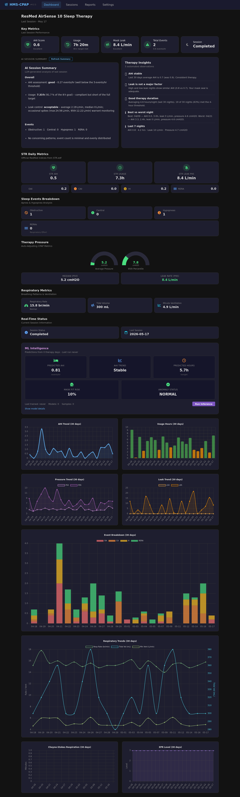
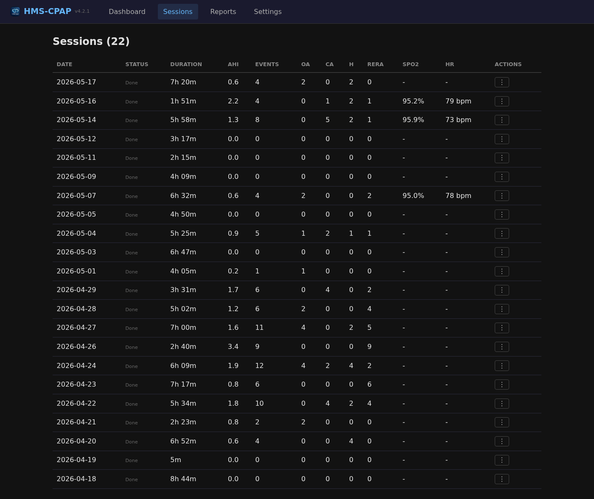
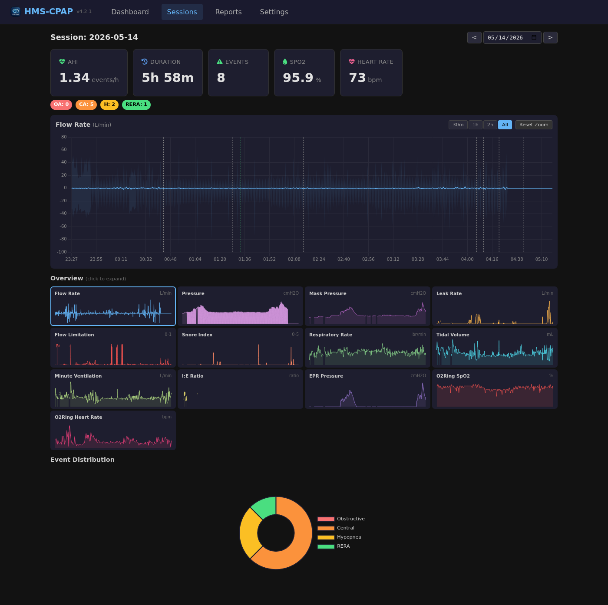
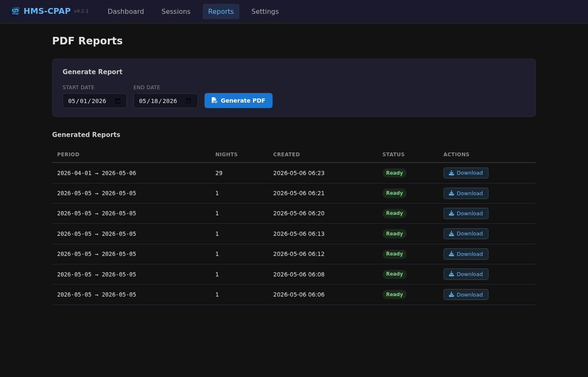
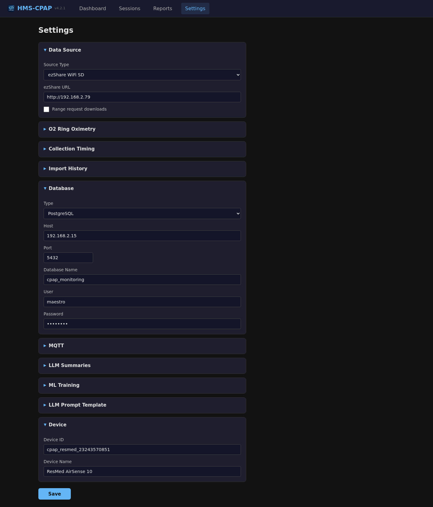

# HMS-CPAP

[](https://opensource.org/licenses/MIT)
[](https://github.com/hms-homelab/hms-cpap/pkgs/container/hms-cpap)
[](https://github.com/hms-homelab/hms-cpap/actions)
[](https://www.buymeacoffee.com/aamat09)

**Lightweight C++ microservice for CPAP data collection with built-in web dashboard, PDF reports, and Home Assistant integration.**

> ### ⚠️ Not a medical device
>
> HMS-CPAP is a hobbyist data viewer. It is **not** a medical device, it is **not**
> cleared or approved by any regulator, and it **cannot** diagnose anything or tell
> you whether your therapy is working. It is not a monitoring or alarm system.
>
> **Never change your therapy settings based on this software.** Talk to the
> clinician who manages your therapy. The numbers here can be wrong: the parsers
> read undocumented, reverse-engineered formats, and data collection can fail
> silently.
>
> Read **[DISCLAIMER.md](DISCLAIMER.md)** before using this. By using it you accept
> the [Terms of Use](TERMS.md).
>
> This project is independent and is **not affiliated with or endorsed by** ResMed,
> Philips, Löwenstein, SleepHQ, or any other company named here. See [NOTICE](NOTICE).

Automatically extracts sleep therapy data from ResMed and Lowenstein Prisma CPAP machines, parses EDF/WMEDF files with its own signal-analysis engine, and publishes 47+ metrics to Home Assistant via MQTT discovery. Includes a full Angular web UI with detailed waveform charting, PDF report generation, O2Ring pulse oximetry, automatic SleepHQ export, LLM-powered session summaries, and ML intelligence. Supports two data sources: ezShare WiFi SD with bridge, or local filesystem.

## Screenshots

**Dashboard** -- Key metrics, AI session summary, therapy insights, STR daily indices, sleep events, pressure gauges, respiratory metrics, ML intelligence, and 30-day trend charts.



**Sessions** -- Nightly session list with O2Ring SpO2/HR, event breakdown, and live session indicator.



**Session Detail** -- Per-session metrics with O2Ring SpO2/HR overlay, 13 zoomable signal charts, event markers, and doughnut event distribution.



**PDF Reports** -- Generate multi-night therapy reports with date range picker. Download as PDF for sharing with your doctor.



**Settings** -- Configure data source, O2Ring oximetry, SleepHQ sync, database, MQTT, LLM summaries, ML training, and device identity. Hot-reload without restart.



**Upload** -- Bring data in by hand from any browser -- no shared network or WiFi SD required. Drop a CPAP `.zip` (ResMed or Lowenstein) and it merges into the archive and reparses; drop a Wellue O2 Ring `.csv` export and it parses server-side into an oximetry session. The O2 Ring path is a simple, OSCAR-free way to actually view your pulse-oximetry data.


## Supported Devices

| Manufacturer | Models | Live Sessions | Data Import |
|---|---|---|---|
| **ResMed** | AirSense 10, AirSense 11 | Yes -- EDF files grow during therapy, real-time charts with 65s refresh | Yes |
| **Lowenstein** | Prisma Line (20A, 20C, 25S, 25ST), Prisma Smart (Max, Plus, Soft) | No -- files written post-session | Yes |

All data sources (ezShare WiFi SD, local filesystem) work with both manufacturers -- the WiFi SD adapter sits in the machine's SD card slot regardless of brand.

**ResMed** EDF files grow incrementally during therapy, enabling live session monitoring with pulsing LIVE badge and auto-refreshing charts.

**Lowenstein Prisma** files are written atomically after each mask-on/mask-off cycle. Prisma Line machines write `therapy.pdat` (ZIP archive) to SD card. Prisma Smart machines write raw directory trees. Both formats are auto-detected. Full session parsing includes WMEDF signals, XML events, AHI/event metrics, and breathing summaries.

## Features

- **HA-Style Web Dashboard** - 10 section components with pressure gauges, AI summary, therapy insights, ML predictions
- **2 Data Sources** - ezShare WiFi SD + bridge, or local files
- **47+ Metrics** - AHI, leak rate, pressure, usage hours, events, daily summary, LLM AI summary
- **Home Assistant Auto-Discovery** - Instant MQTT integration with 47 sensor entities
- **PDF Reports** - Generate multi-night therapy reports for sharing with your doctor
- **Therapy Insights Engine** - Automated analysis of AHI trends, leak correlation, compliance, best/worst nights
- **Pulse Oximetry** - Wellue O2Ring SpO2/HR with ODI calculation, session overlay, and fallback in session cards
- **Manual Upload Page** - Drag-and-drop a CPAP `.zip` or a Wellue O2 Ring `.csv` from any browser, no shared network needed. CPAP zips merge into the archive and reparse; O2 Ring CSVs (both Wellue export dialects, auto-detected sample interval) become oximetry sessions -- an OSCAR-free way to view your O2 ring data. See [docs/UPLOAD.md](docs/UPLOAD.md)
- **SleepHQ Auto-Export** - Automatically forward each completed night's raw data to SleepHQ via their public API, toggleable on session complete and on local import, plus a manual per-night "Upload to SleepHQ" button
- **Multi-Database** - PostgreSQL, MySQL/MariaDB, or SQLite (auto-created on first run)
- **Signal Charts** - Per-minute resolution with event markers and oximetry overlay
- **Live Sessions** - Pulsing LIVE badge, 65s auto-refresh, growing charts during therapy
- **ML Intelligence** - AHI prediction, compliance forecasting, mask fit risk, anomaly detection
- **LLM Session Summary** - AI-generated therapy analysis via Ollama (daily, weekly, monthly)
- **Windows + Linux** - Native builds for both platforms, Docker image for CI
- **Ultra-Lightweight** - 6.5 MB native binary
- **1,091 Unit Tests** - Comprehensive coverage across all services

## Table of Contents

- [Supported Devices](#supported-devices)
- [Quick Start](#quick-start)
- [Data Sources](#data-sources)
- [Configuration](#configuration)
- [CLI Reference](#cli-reference)
- [Deployment](#deployment)
- [Home Assistant Integration](#home-assistant-integration)
- [Architecture](#architecture)
- [Development](#development)
- [FAQ](#faq)
- [Contributing](#contributing)

## Quick Start

```bash
# 1. Clone and build
git clone https://github.com/hms-homelab/hms-cpap.git
cd hms-cpap
mkdir build && cd build
cmake .. && make -j$(nproc)

# 2. Configure
cp ../.env.example ../.env
nano ../.env  # Set MQTT, DB, and source settings

# 3. Run (choose your data source)
CPAP_SOURCE=ezshare    ./hms_cpap   # ezShare WiFi SD via bridge (recommended)
CPAP_SOURCE=local      ./hms_cpap   # Local filesystem (ResMed DATALOG)
CPAP_SOURCE=lowenstein ./hms_cpap   # Lowenstein Prisma (local dir or WiFi SD)

# 4. Open the dashboard
# http://localhost:8893
```

## Data Sources

One wireless hardware path plus a local filesystem option. Both work with ResMed and Lowenstein machines -- the WiFi SD adapter sits in any standard SD card slot:

### ezShare WiFi SD (Recommended)

**How it works:** The ezShare creates its own WiFi AP, which means it can't talk to your home network directly. You'll need a bridge to bring it onto your network. A convenient dual-WiFi bridge is provided by [hms-mm](https://github.com/hms-homelab/hms-mm) -- one radio connects to the ezShare, the other to your home WiFi, and it serves the files over HTTP. HMS-CPAP polls the bridge every 65s.

**Hardware (optional):** ezShare WiFi SD adapter + a bridge device running [hms-mm](https://github.com/hms-homelab/hms-mm) firmware.

### Local Filesystem

**How it works:** Reads EDF files directly from a local directory (USB drive, NAS share, or mounted storage).

**Use case:** Offline analysis, importing historical data, or running without WiFi SD hardware.

**Setup:**

1. Copy your ResMed SD card's `DATALOG` folder to a local path (or mount the SD card directly):
   ```bash
   # Example: mount SD card
   sudo mount /dev/sdb1 /mnt/cpap-sd

   # Or copy to NAS/local disk
   cp -r /mnt/cpap-sd/DATALOG /mnt/archive/cpap/DATALOG
   ```

2. Configure hms-cpap to use local mode:
   ```bash
   CPAP_SOURCE=local
   CPAP_LOCAL_DIR=/mnt/archive/cpap/DATALOG
   ```
   Or via `~/.hms-cpap/config.json`:
   ```json
   {
     "source": "local",
     "local_dir": "/mnt/archive/cpap/DATALOG"
   }
   ```

3. Start hms-cpap. It will poll the directory each burst interval for new sessions.

4. **Import existing history:** Open Settings in the web UI, expand "Import History", and click **Import History**. The start/end dates auto-populate from your DATALOG folder. This parses all EDF files and saves them to the database. See also the [CLI Reference](#cli-reference) for command-line alternatives.

**Expected directory structure:**
```
DATALOG/
  20250815/
    23243570851_BRP.edf    # Breathing pattern
    23243570851_PLD.edf    # Pressure/leak data
    23243570851_EVE.edf    # Events (apneas, hypopneas)
    23243570851_SAD.edf    # SpO2/heart rate (if oximeter)
    23243570851_CSL.edf    # Clinical summary
  20250816/
    ...
  STR.edf                  # Daily therapy summaries
```

### Lowenstein Prisma

Both data source paths above (ezShare, local) work with Lowenstein machines. Set `CPAP_SOURCE=lowenstein` and point `CPAP_LOCAL_DIR` at the SD card contents or a copy. HMS-CPAP auto-detects both Prisma formats:

**Prisma Smart** writes a raw directory tree:
```
therapy/
  events/
    20260514/
      event_000370.xml      # Respiratory events (apneas, hypopneas)
    20260515/
      event_000380.xml
  signals/
    20260514/
      signal_000370.wmedf   # Therapy signals (pressure, flow, SpO2)
    20260515/
      signal_000380.wmedf
```

**Prisma SMART max** (newer firmware, e.g. 3.17) writes a combined tree, with
events and signals together under a per-night session folder and 3-digit
sequence numbers:
```
0040181394/                # device serial
  20260607/
    0000/                  # session index
      event_000.xml
      signal_000.wmedf
      trendCurves.tc
  20260620/
    0001/
      event_003.xml
      signal_003.wmedf
```
Point `local_dir` at either the SD root (containing the serial folder) or the
serial folder itself; HMS-CPAP detects this layout automatically.

**Prisma Line** writes ZIP archives:
```
therapy.pdat              # ZIP containing the directory tree above
config.pcfg               # ZIP containing device.xml and configuration
```

Configuration example:
```json
{
  "source": "lowenstein",
  "local_dir": "/mnt/archive/prisma",
  "device_name": "Lowenstein Prisma 20A"
}
```

## Configuration

All configuration via environment variables (12-factor app). See [`.env.example`](.env.example) for complete reference.

### Required Variables

```bash
# Data source
CPAP_SOURCE=ezshare          # ezshare or local
EZSHARE_BASE_URL=http://192.168.4.1  # ezShare bridge IP

# MQTT broker (required for Home Assistant)
MQTT_BROKER=localhost
MQTT_PORT=1883
MQTT_USER=mqtt_user
MQTT_PASSWORD=your_mqtt_password
```

### Optional Variables

```bash
# Local directory (required when CPAP_SOURCE=local, config.json key: local_dir)
CPAP_LOCAL_DIR=/path/to/DATALOG

# Device identification
CPAP_DEVICE_ID=resmed_airsense10
CPAP_DEVICE_NAME="ResMed AirSense 10"

# Collection interval (seconds)
BURST_INTERVAL=65

# Database (defaults to SQLite if not set)
DB_TYPE=sqlite                # sqlite, postgresql, or mysql
DB_HOST=localhost
DB_NAME=cpap_data
DB_USER=cpap_user
DB_PASSWORD=your_db_password

# Web UI port
WEB_PORT=8893
```

## CLI Reference

HMS-CPAP supports several command-line modes for batch operations. These run once and exit (no web server, no polling loop).

### Reparse Sessions

Re-parse therapy sessions from a local DATALOG archive for a date range. Deletes existing DB records for those dates and re-imports from the EDF files.

```bash
# Reparse a date range
hms_cpap --reparse /path/to/DATALOG 2025-08-15 2025-09-15

# Reparse a single day
hms_cpap --reparse /path/to/DATALOG 2025-08-15
```

This is the CLI equivalent of the "Import History" button in the web UI Settings page.

### Backfill STR Daily Summaries

Parse a ResMed `STR.edf` file and upsert all daily therapy summaries into the database. This populates the `cpap_daily_summary` table with AHI, usage hours, leak rates, and other per-day metrics.

```bash
hms_cpap --backfill /path/to/STR.edf
```

### Custom Config Path

```bash
hms_cpap --config /etc/hms-cpap/config.json
```

## Deployment

### Native Systemd (Recommended)

```bash
# Build frontend + backend, run tests, and deploy
./build_and_deploy.sh --deploy

# Or manually:
cd frontend && npm ci && npx ng build --configuration production && cd ..
mkdir build && cd build && cmake -DBUILD_WITH_WEB=ON .. && make -j$(nproc)
sudo cp hms_cpap /usr/local/bin/
sudo cp ../.env /etc/hms-cpap/.env  # Edit with your settings

# Service file: /etc/systemd/system/hms-cpap.service
```

```ini
[Unit]
Description=HMS-CPAP Data Collection Service
After=network.target postgresql.service emqx.service

[Service]
Type=simple
EnvironmentFile=/etc/hms-cpap/.env
ExecStart=/usr/local/bin/hms_cpap
Restart=always
RestartSec=10

[Install]
WantedBy=multi-user.target
```

```bash
sudo systemctl daemon-reload
sudo systemctl enable hms-cpap
sudo systemctl start hms-cpap
```

### Docker

```bash
docker run -d \
  --name hms-cpap \
  --env-file .env \
  -p 8893:8893 \
  -v cpap_data:/data \
  ghcr.io/hms-homelab/hms-cpap:latest
```

### Raspberry Pi

Two deployment scripts are provided for running hms-cpap on a Raspberry Pi. Both read `PI_HOST` and `PI_PASSWORD` from environment variables or your `.env` file -- no hardcoded IPs or passwords.

**Setup:** Add your Pi credentials to `.env`:

```bash
# In .env
PI_HOST=user@192.168.1.50
PI_PASSWORD=your_password
```

Or pass them inline:

```bash
PI_HOST=user@192.168.1.50 PI_PASSWORD=mypass ./deploy_to_pi.sh
```

If either variable is missing, the script exits with a clear error message telling you what to set.

**Cross-compile deploy** (build on your machine, deploy ARM binary to Pi):

```bash
./deploy_to_pi.sh
```

Builds the Angular frontend, cross-compiles the C++ backend for ARM, copies the binary and static files to the Pi, and restarts the service.

**Native build deploy** (push code to Pi, build on Pi):

```bash
./deploy_to_pi_native.sh
```

Pushes via git, builds natively on the Pi (slower but avoids cross-compilation issues), deploys, and restarts. Use this if cross-compiled binaries have issues on your Pi model.

### Windows

Download the latest release from [Releases](https://github.com/hms-homelab/hms-cpap/releases). Unzip and run:

```powershell
# Edit config.example.json with your settings
hms_cpap.exe
# Open http://localhost:8893
```

## Home Assistant Integration

HMS-CPAP uses **MQTT Discovery** for automatic Home Assistant integration.

### 1. Configure MQTT in Home Assistant

`configuration.yaml`:
```yaml
mqtt:
  broker: localhost
  username: mqtt_user
  password: your_mqtt_password
  discovery: true
```

### 2. Restart Home Assistant

Sensors auto-appear as a device with 47+ entities:

- `sensor.cpap_ahi` - Apnea-Hypopnea Index
- `sensor.cpap_leak_rate` - Leak rate (L/min)
- `sensor.cpap_pressure_current` - Current pressure (cmH2O)
- `sensor.cpap_usage_hours` - Total usage hours
- `binary_sensor.cpap_session_active` - Live session indicator
- ... and 42 more metrics

## Architecture

```
┌─────────────────┐     ┌──────────────────┐
│  ResMed CPAP    │     │ Lowenstein Prisma │
│  AirSense 10/11 │     │ Line / Smart      │
└────────┬────────┘     └────────┬──────────┘
         │ SD Card Slot          │ SD Card Slot
         │                       │
         └───────────┬───────────┘
                     │
             ┌───────────┴───────────┐
             │                       │
             ▼                       ▼
       ┌──────────┐            ┌──────────┐
       │ ezShare  │            │  Local   │
       │ WiFi SD  │            │  FS/USB  │
       └────┬─────┘            └────┬─────┘
            │ WiFi AP               │
            ▼                       │
       ┌──────────┐                 │
       │ hms-mm   │                 │
       │ bridge   │                 │
       └────┬─────┘                 │
            │ HTTP                  │
            ▼                       ▼
┌──────────────────────────────────────────┐
│            HMS-CPAP Service              │
│  BurstCollector + PrismaIngestion        │
│  EDFParser + PrismaParser (WMEDF/XML)    │
│  Angular Web UI (port 8893)              │
│  PDF Reports + LLM Summary + ML Intel    │
└──────────┬──────────┬────────────────────┘
           │          │
    ┌──────┘          └──────┐
    ▼                        ▼
┌──────────┐       ┌──────────────┐
│ Database │       │ MQTT (EMQX)  │
│ PG/MySQL │       │ 47 sensors   │
│ /SQLite  │       └──────┬───────┘
└──────────┘              │
                          ▼
                  ┌───────────────┐
                  │Home Assistant │
                  └───────────────┘
```

### ResMed EDF File Types

| File | Content | During Therapy | After Mask-Off |
|------|---------|----------------|----------------|
| BRP.edf | Flow/pressure (25 Hz) | Grows every 60s | Final flush |
| PLD.edf | Pressure/leak (0.5 Hz) | Grows every 60s | Final flush |
| SAD.edf | SpO2/HR (1 Hz) | Grows every 60s | Final flush |
| EVE.edf | Apnea/hypopnea events | Updated live | Final flush |
| CSL.edf | Clinical summary | Created at start | Final flush |
| STR.edf | Daily therapy summary | N/A | Written ~50s after mask-off |

### Lowenstein Prisma File Types

| File | Content | Notes |
|------|---------|-------|
| signal_NNNNNN.wmedf | Therapy signals (pressure, flow, leak, SpO2, HR) | 8-bit or 16-bit EDF variant, 1s resolution |
| event_NNNNNN.xml | Respiratory events (apneas, hypopneas, RERA, snore) | Flat XML with RespEvent and DeviceEvent elements |
| device.xml | Device serial number, type, firmware version | In config.pcfg ZIP or conf/ directory |

## Development

### Build Requirements

- C++17 compiler (GCC 9+, Clang 10+, MSVC 2022+)
- CMake 3.16+
- Node.js 22+ (for Angular frontend)

### Build & Test

The recommended way to build is via the build script, which handles frontend + backend + tests in one step:

```bash
# Build everything (frontend + backend + run tests)
./build_and_deploy.sh

# Build and deploy to systemd service
./build_and_deploy.sh --deploy

# Backend only (skip Angular build)
./build_and_deploy.sh --skip-fe
```

Or manually:

```bash
# Build frontend
cd frontend && npm ci && npx ng build --configuration production && cd ..

# Build backend
mkdir build && cd build
cmake -DBUILD_TESTS=ON -DBUILD_WITH_WEB=ON ..
make -j$(nproc)

# Run tests
./tests/run_tests

# Run service
./hms_cpap
```

### Database Setup

**SQLite** (default) -- auto-created, no setup needed.

**PostgreSQL:**
```bash
psql -U postgres -c "CREATE DATABASE cpap_monitoring;"
psql -U postgres -d cpap_monitoring -f scripts/schema.sql
```

**MySQL:**
```bash
mysql -u root -e "CREATE DATABASE cpap_monitoring;"
mysql -u root cpap_monitoring < scripts/schema_mysql.sql
```

### Running Tests

```bash
cd build && ./tests/run_tests
```

**425 tests** across 34 test suites covering EDF/WMEDF parsing, session discovery, Prisma ingestion, ezShare firmware compatibility, MQTT publishing, database operations, ML training, and more.

## FAQ

### Why not use existing CPAP data solutions?

Most solutions require cloud services, proprietary apps, or manual SD card removal. HMS-CPAP provides:
- 100% local, no cloud
- Automatic collection via WiFi
- Built-in web dashboard with full signal charting
- Open-source parsing & analysis algorithms
- Home Assistant integration
- ML-ready database storage

### Does this work with other CPAP brands?

Currently supports **ResMed AirSense 10/11** (real-time + import) and **Lowenstein Prisma** (import). ResMed has full real-time live session support via WiFi SD adapters. Lowenstein Prisma supports SD card data import with full session parsing, event detection, and breathing signal analysis.

### What about data privacy?

All data stays local:
- No cloud services
- No external API calls
- Your network only

### Can I use this alongside OSCAR?

Yes. HMS-CPAP reads the same SD-card files independently, so you can run both simultaneously and cross-validate metrics.

## Contributing

Contributions welcome! Please:

1. Fork repository
2. Create feature branch (`git checkout -b feature/amazing-feature`)
3. Add tests for new functionality
4. Ensure tests pass (`./tests/run_tests`)
5. Open Pull Request

## Legal

| Document | What it covers |
|---|---|
| **[DISCLAIMER.md](DISCLAIMER.md)** | **Not a medical device.** Read this first. |
| [LICENSE](LICENSE) | MIT License -- the binding grant |
| [TERMS.md](TERMS.md) | Terms of use, warranty, liability, contributions |
| [PRIVACY.md](PRIVACY.md) | What is stored, and every way data can leave your machine |
| [NOTICE](NOTICE) | Trademarks, independence, clean-room statement, dependencies |

### License

MIT -- see [LICENSE](LICENSE). Use it, modify it, sell it; keep the notice.

### Independence

Not affiliated with, endorsed by, or supported by ResMed, Philips, Lowenstein
Medical, SleepHQ, or any other company named in this repository. All trademarks
belong to their owners and are used descriptively. See [NOTICE](NOTICE).

The parsers were written independently from public format documentation and
inspection of files from physically owned devices. **No OSCAR source code was
copied or derived from** -- OSCAR is GPLv3 and was consulted only to understand
device data formats. See [NOTICE](NOTICE) section 2.

### Privacy at a glance

No telemetry, no analytics, no phone-home. Your data stays on your hardware. The
only outbound integrations are SleepHQ export, CpapDash sync, and LLM summaries
-- all **off by default** and each one you enable yourself. The service ships
with **no authentication**; do not expose it to the internet. Details in
[PRIVACY.md](PRIVACY.md).

### Third-Party Components

Full list with licenses in [NOTICE](NOTICE). Direct dependencies include Drogon,
libcurl, OpenSSL, SQLite, libpqxx/libpq, Paho MQTT (EPL 2.0), JsonCpp,
nlohmann/json, spdlog, miniz, Angular, and Chart.js.

## Acknowledgments

- The open-source CPAP community - public documentation of the EDF/WMEDF file formats
- [ResMed](https://www.resmed.com/) - CPAP hardware
- [Lowenstein Medical](https://www.lowensteinmedical.com/) - Prisma CPAP hardware
- [Home Assistant](https://www.home-assistant.io/) - Smart home platform
- CPAP community on Reddit

---

**Made for better sleep and open health data**

*If this project helps you, consider starring the repository!*

---

## Support

If this project is useful to you, consider buying me a coffee!

[](https://www.buymeacoffee.com/aamat09)
