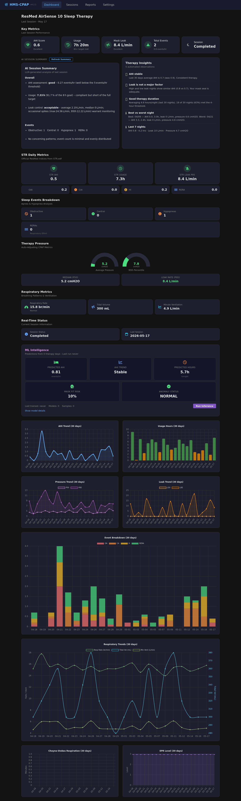

# HMS-CPAP

[](https://opensource.org/licenses/MIT)
[](https://github.com/hms-homelab/hms-cpap/pkgs/container/hms-cpap)
[](https://github.com/hms-homelab/hms-cpap/actions)
[](https://www.buymeacoffee.com/aamat09)

**A small, local-only CPAP data viewer. Reads your machine's SD card, shows you your nights in a web dashboard, and (optionally) publishes them to Home Assistant.**

> ### Not a medical device
>
> HMS-CPAP is a hobbyist data viewer. It is not a medical device, is not cleared
> by any regulator, and cannot diagnose anything or tell you whether your
> therapy is working. **Never change your therapy settings based on this
> software.** Talk to the clinician who manages your therapy. The numbers can be
> wrong: the parsers read undocumented, reverse-engineered formats.
>
> Read [DISCLAIMER.md](DISCLAIMER.md) before using this. By using it you accept
> the [Terms of Use](TERMS.md). Not affiliated with ResMed, Philips, Löwenstein,
> SleepHQ, or anyone else named here. See [NOTICE](NOTICE).



## What it is

A C++ service with a built-in Angular web UI. It pulls the files your CPAP
writes to its SD card (over WiFi via an ezShare adapter, or from a folder),
parses them itself, stores the results in a database, and shows you the data.
It is a fully local-first experience.

**Supported machines**

| Manufacturer | Models | Live sessions |
|---|---|---|
| ResMed | AirSense 10, AirSense 11 | Yes, charts update every 65s during therapy |
| Lowenstein | Prisma Line (20A, 20C, 25S, 25ST), Prisma Smart (Max, Plus, Soft) | No, files are written after each session |

## Features

- **Dashboard** with the key numbers per night, 30-day trends, pressure gauges, and a per-night CpapDash Index (usage + AHI + leak in one number)
- **Session detail** with 13 zoomable signal charts, event markers, and live view while you sleep (ResMed)
- **Events explorer**: every respiratory event across all nights, filterable by date, type, and duration
- **PDF reports** for a date range, made for handing to your doctor
- **Pulse oximetry**: Wellue O2Ring SpO2/HR overlay with ODI, imported by CSV upload
- **Manual upload page**: drag in a CPAP `.zip` or O2Ring `.csv` from any browser, no shared network needed
- **Home Assistant**: 47+ sensors via MQTT auto-discovery, or install it as an add-on and run it inside HA
- **Equipment & supply reminders**: track mask, filters, tubing per profile; days-left sensors and due/overdue events for automations
- **SleepHQ export** (off by default): forward each finished night to SleepHQ
- **ResMed myAir comparison** (off by default, read-only): put ResMed's own nightly score next to CpapDash's
- **LLM night summaries** (off by default): plain-language write-ups via Ollama or any OpenAI-compatible endpoint
- **ML insights** (off by default): AHI prediction, compliance forecast, mask-fit risk, anomaly detection
- **Any database**: SQLite (default, zero setup), PostgreSQL, or MySQL/MariaDB
- **Runs on** Windows, macOS, Linux, Raspberry Pi, Docker, or as a Home Assistant add-on

## Install

Pick one. Every path ends at the same four-screen setup wizard in your browser:
where to store data, where the data comes from, which optional extras to turn
on, and whether to start at boot.

### Home Assistant add-on (easiest if you run HA)

Settings -> Apps -> three dots -> Repositories, add:

```
https://github.com/hms-homelab/hms-cpap-ha-addon
```

Install **CpapDash**, start it, and the wizard opens through Ingress. No port to
open, no second password; the MQTT broker's credentials are picked up
automatically.

### Windows

Download `CpapDashDesktop-Setup.exe` from
[Releases](https://github.com/hms-homelab/hms-cpap/releases) and run it. No
admin rights needed. A tray icon gives you Open Dashboard, Sync Now, and Start
at Login.

### macOS

Download `hms-cpap-macos-arm64.zip` from
[Releases](https://github.com/hms-homelab/hms-cpap/releases), unzip, run:

```bash
./hms_cpap
```

Your browser opens on http://localhost:8893/setup.

### Docker

```bash
docker compose up -d
```

Brings up CpapDash, PostgreSQL, and a Mosquitto broker. Open
http://localhost:8893/setup. Config lives in the `cpap_config` volume and data
in `cpap_data`; neither is touched by image updates.

Or a single container:

```bash
docker run -d --name hms-cpap -p 8893:8893 \
  -v cpap_config:/config -v cpap_data:/data \
  ghcr.io/hms-homelab/hms-cpap:latest
```

### Linux / Raspberry Pi (build from source)

```bash
git clone https://github.com/hms-homelab/hms-cpap.git
cd hms-cpap
./build_and_deploy.sh --deploy   # builds frontend + backend, runs tests, installs the systemd unit
```

Or without the script: `mkdir build && cd build && cmake .. && make -j$(nproc) && ./hms_cpap`.

### Getting the data off the machine

- **ezShare WiFi SD** (recommended): the card sits in the CPAP's SD slot and
  serves files over WiFi. It makes its own network, so you need a bridge such as
  [hms-mm](https://github.com/hms-homelab/hms-mm) (Mule & Miner) to put it on
  your LAN. The wizard can scan for one.
- **Local folder**: point the wizard at the SD card root (the folder that holds
  both `STR.edf` and `DATALOG/`), on a USB reader, NAS share, or any mount.
- **Upload page**: zip the card and drop it in the browser.

Everything else (config keys, CLI flags, MQTT sensor list, myAir setup,
architecture, development, cross-compiling) is in
**[docs/REFERENCE.md](docs/REFERENCE.md)**.

## Disclaimers

- **Not a medical device.** It does not diagnose anything and it is not a
  monitoring or alarm system. Never adjust your therapy based on this software.
  [DISCLAIMER.md](DISCLAIMER.md)
- **The data can be wrong.** Parsers are reverse-engineered from undocumented
  formats and collection can fail silently. Cross-check with your clinician or
  the manufacturer's own tools.
- **No authentication.** The web UI has no login. Keep it on your LAN; do not
  expose it to the internet.
- **Privacy.** There is no telemetry and nothing phones home. The only outbound integrations are
  SleepHQ, CpapDash sync, myAir, and LLM summaries, all off by default and each
  one you enable yourself. [PRIVACY.md](PRIVACY.md)
- **Independence.** Not affiliated with or endorsed by ResMed, Philips,
  Lowenstein Medical, SleepHQ, or any other company named here. Trademarks
  belong to their owners. No OSCAR source was copied or derived from; it was
  consulted only to understand file formats. [NOTICE](NOTICE)
- **License.** MIT. Use it, modify it, sell it; keep the notice.
  [LICENSE](LICENSE) · [TERMS.md](TERMS.md)

## Contributing & support

Fork, branch, add tests, make sure `./tests/run_tests` passes, open a PR. See
[docs/CONTRIBUTING.md](docs/CONTRIBUTING.md).

If this project is useful to you, consider
[buying me a coffee](https://www.buymeacoffee.com/aamat09) or starring the repo.
