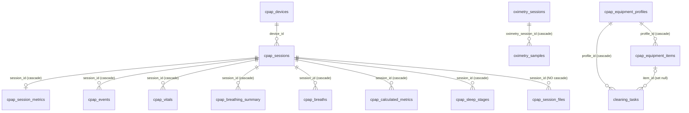

# The database

hms-cpap stores everything in one database, on one of three engines: SQLite
(the default and what the setup wizard hands most users), MySQL/MariaDB, or
PostgreSQL. All three hold the same tables. This page maps them: what each
table is, how it is keyed, how the tables relate, who writes and reads each one,
and the time rules every date column follows.

For how the code reaches the database, see [layers.md](layers.md).

## Where the schema is defined

| Engine | Created at runtime by | Reference copy |
|---|---|---|
| SQLite | `SQLiteDatabase::createSchema()`, `src/database/SQLiteDatabase.cpp` | `scripts/schema_sqlite.sql` |
| MySQL | `MySQLDatabase::createSchema()`, `src/database/MySQLDatabase.cpp` | `scripts/schema_mysql.sql` |
| PostgreSQL | the migration block in `DatabaseService::connect()`, `src/database/DatabaseService.cpp` (`PostgresDatabase` forwards to it) | `scripts/schema.sql` |

The runtime DDL is what actually runs; every statement is `CREATE ... IF NOT
EXISTS` or a guarded `ALTER`, so connecting is also migrating. The
`scripts/schema*.sql` files are for manual setup and review and are kept in
step by hand. Two differences between them and the runtime today:

- `oximetry_sessions` and `oximetry_samples` are created at runtime on all three
  engines but appear in none of the `scripts/schema*.sql` files.
- `cpap_sleep_stages` is in all three `scripts/schema*.sql` files but is created
  at runtime **only on PostgreSQL**. On SQLite and MySQL it exists only if it
  was created from the script by hand.

Column types differ by engine in the usual way (`TEXT` timestamps on SQLite,
`DATETIME` on MySQL, `TIMESTAMP` on PostgreSQL; `INTEGER AUTOINCREMENT` /
`INT AUTO_INCREMENT` / `SERIAL`; `checkpoint_files` is `TEXT` on SQLite and
`JSONB` on PostgreSQL). SQLite runs with `PRAGMA foreign_keys=ON`, so its
`ON DELETE CASCADE` clauses are enforced like the other two engines'.

## The time rules

Every date question in this schema is answered by one of three rules. Getting
them mixed up is the most common way to put a night on the wrong day.

1. **CPAP timestamps are the machine's local wall clock.** The EDF header time
   is read with `mktime` (local) and stored rendered with `localtime`, so
   `session_start` in the table is what the machine displayed.
2. **Oximetry timestamps are the ring's wall clock, stored as if UTC.** The
   ring parsers read the ring's printed time with `timegm` and the columns render
   it back with `gmtime`, so `start_time` is what the ring displayed. Never mix
   a `localtime` render with an oximetry `time_point`.
3. **A night (sleep day) is the start shifted back 12 hours.** A session that
   starts at 02:00 on the 11th belongs to the night of the 10th. In SQL:
   SQLite `date(session_start, '-12 hours')`, MySQL
   `DATE(session_start - INTERVAL 12 HOUR)`, PostgreSQL
   `DATE(session_start - INTERVAL '12 hours')`. In C++:
   `strDayForSessionStart()` (`src/services/SyncFolderState.cpp`), which gives
   `YYYYMMDD`; for a ring start, `oximetryNightOf()`
   (`include/services/RemovedNights.h`), the same shift on the UTC clock.
   ResMed's DATALOG folders use the same split (a real card's folder `20260329`
   holds `20260330_041405_BRP.edf`), so a folder name and a night key are the
   same string.

`cpap_daily_summary.record_date` is that night as a date (`YYYY-MM-DD`). An STR
day record arrives stamped at local noon of its day, which the rule maps back
onto the same date.

## How the tables relate

Tables without a line are joined by value, not by key:
`cpap_daily_summary`, `cpap_summaries`, `cpap_removed_nights` and
`cpap_reports` by `device_id` and a date; `cpap_sync_folders` by its
`date_folder`; `oximetry_sessions` to a CPAP night by the night of its
`start_time` (its own `device_id` is always `o2ring`, see below);
`cpap_myair_records` by `record_date` alone.

`cpap_session_files` has no cascade on any engine: whatever deletes a session
deletes its file rows first (`deleteSessionsByDateFolder`, `removeNight`).

## The tables

### Therapy: sessions and what hangs off them

| Table | Key | What it holds | Written by | Read by |
|---|---|---|---|---|
| `cpap_devices` | `device_id` | One row per machine: name, serial, model/version ids, `last_seen`. | `saveSession` (upsert), `updateDeviceLastSeen` | nothing outside the backends today; a registry |
| `cpap_sessions` | `id`; UNIQUE `(device_id, session_start)` | One mask-on session: start/end, duration, the EDF paths, `checkpoint_files` (per-file sizes the burst compares to spot growth), `force_completed`. | `saveSession` (upsert on the start), `markSessionCompleted`, `reopenSession`, `setForceCompleted`, `updateCheckpointFileSizes`; deleted by `deleteSessionsByDateFolder` (reparse) and `removeNight` | everything: `QueryService`, the burst's delta (`getLastSessionStart`), the agent tools, SleepHQ export |
| `cpap_session_files` | `id`; UNIQUE `(session_id, rel_path)` | SDD-014: which card files (`brp`/`pld`/`sad`/`eve`/`csl`, path under `DATALOG/`) make up the session. | `replaceSessionFiles` after every save | `getSessionFilesForDateFolder` (SleepHQ export, the burst) |
| `cpap_session_metrics` | `id`; UNIQUE `session_id` | The session's computed numbers: AHI and `index_kind` (`ahi` or `ungraded`, SDD-024), event counts, SpO2/HR, pressures, leak percentiles, therapy mode. | `saveSession` | `QueryService`, agent tools, `getNightlyMetrics` (the burst's MQTT night publish), the daily aggregation |
| `cpap_events` | UNIQUE `(session_id, event_timestamp)` | Scored events (type, time, duration). | `saveSession` | `QueryService` (session events, the cross-night event search), agent tools |
| `cpap_vitals` | UNIQUE `(session_id, timestamp)` | SpO2 and heart rate samples from the machine's own oximetry input. | `saveSession` | `QueryService`, agent tools |
| `cpap_breathing_summary` | UNIQUE `(session_id, timestamp)` | Per-interval flow and pressure min/avg/max. | `saveSession` | `QueryService` (session signals) |
| `cpap_breaths` | UNIQUE `(session_id, onset)` | Breath-by-breath: tidal volume, inspiratory/expiratory time, flow limitation. | `saveSession` | `QueryService` |
| `cpap_calculated_metrics` | UNIQUE `(session_id, timestamp)` | Per-minute derived signals: respiratory rate, minute ventilation, I:E, leak, flow and pressure percentiles, snore, target ventilation, and the PLD pressures: `mask_pressure`, `epr_pressure` and `therapy_pressure` (SDD-030; on a bi-level the last two are EPAP and IPAP). | `saveSession` | `QueryService` (session signals, trends), `getNightlyMetrics` (the night's averages, MQTT) |
| `cpap_sleep_stages` | UNIQUE `(session_id, epoch_start_ts)` | Inferred sleep stage per 30 s epoch (0 wake, 1 light, 2 deep, 3 REM), confidence, `provisional`, model version. Runtime-created on PostgreSQL only. | `LiveSleepStageRunner` (raw SQL through `executeQuery`) | `CpapController::sessionSleepStages` |

### Therapy: per night and per range

| Table | Key | What it holds | Written by | Read by |
|---|---|---|---|---|
| `cpap_daily_summary` | UNIQUE `(device_id, record_date)` | One row per night: usage (`duration_minutes`, `patient_hours`), the index family, pressures, leak, SpO2, settings, mask pairs, faults. SDD-026: the shared columns are **ours** wherever the night has sessions; the `*_str` columns keep what the machine's STR said; `index_source` says which filled the shared columns (`computed` or `str`). `machine_hours` is ResMed's lifetime counter. | `saveSTRDailyRecords` (the STR, fills what we did not compute), `aggregateDailySummaryFromSessions` (after every session save and every burst); deleted only by `removeNight` | the dashboard, trends, statistics, compliance (`QueryService`), agent tools, `MLTrainingService` |
| `cpap_summaries` | `id`; index `(device_id, period, range_end)` | LLM-written summaries, `period` `daily`/`weekly`/`monthly` over `range_start..range_end`. | `saveSummary` (the burst's summary generation) | `QueryService::getSummaries` |
| `cpap_myair_records` | `record_date` | SDD-020: what ResMed's myAir servers report for a night, kept apart from our own numbers so the comparison keeps its provenance. `has_data = 0` means ResMed had nothing, not a zero night. | `MyAirService` | `QueryService::getMyAirComparison` |
| `cpap_reports` | `id`; index `(device_id, created_at)` | PDF report jobs: range, status, file. | `ReportGeneratorService`, `BaseReportGenerator` (POSIX builds) | the reports routes |

### Oximetry (O2 ring)

| Table | Key | What it holds | Written by | Read by |
|---|---|---|---|---|
| `oximetry_sessions` | `id`; UNIQUE `filename` | One ring recording: start/end (ring clock, rule 2), duration, interval, SpO2/HR metrics, ODI, `cpap_session_date`. Always stored under `device_id = 'o2ring'` (`kOximetryDeviceId`), whichever path brought it; the filename is its identity, so the same file from the live pull, the card folder (SDD-028) or the upload is one row. | `saveOximetrySession` (upsert on filename), `saveLiveOximetrySample` (one synthetic `live_YYYYMMDD.vld` per day); deleted by `removeNight` | `getOximetrySummary`, `getOximetryRangeSummary`, `getOximetryNightlySpo2`, `QueryService` (session oximetry), SleepHQ export |
| `oximetry_samples` | `id` | The samples: timestamp, SpO2, HR, motion, vibration, validity, `source`. | with its session | the same |

### Collection state

| Table | Key | What it holds | Written by | Read by |
|---|---|---|---|---|
| `cpap_sync_folders` | `date_folder` | SDD-008: per DATALOG folder, whether the night's **files** all arrived (listed, complete, stable signature), and the debts armed at close (`str_due` + `str_day`, `sidecars_due`, the resync counters). Derived from the card, never synced, safe to wipe. | the burst's `updateFolderLedgers`, `processSTRFile` (clears the STR debt); deleted by `removeNight` | the burst (`getSyncFolder`, `listSyncFolders`), `QueryService` (a night's `night_state`: live, complete or partial) |
| `cpap_removed_nights` | `(device_id, night)` | SDD-029: nights an operator removed, `night` as `YYYYMMDD`. Every re-ingest path consults it (the STR write, the burst's store loops and ledger, the `.vld` scan, the live ring pull, the SleepHQ sweep, the backfill) so a removed night stays removed. | `removeNight`; cleared by `restoreNight` (Reparse) | `removedNights`, through `include/services/RemovedNights.h` |

### Equipment and upkeep

| Table | Key | What it holds | Written by | Read by |
|---|---|---|---|---|
| `cpap_equipment_types` | `id`; UNIQUE `type_key` | SDD-004 catalog: six seeded system types (`machine`, `mask`, `tubing`, `filter`, `humidifier`, `headgear`) with default replacement intervals, plus user types. | `EquipmentController` | `EquipmentController`, `CleaningController`, `SupplyPublisher` |
| `cpap_equipment_profiles` | `id`; UNIQUE `client_uuid` | Named setups. Soft-deleted (`deleted`). | `EquipmentController`, `CpapDashSyncService` | the same |
| `cpap_equipment_items` | `id`; UNIQUE `client_uuid`; at most one live `machine` per profile (partial unique index) | The gear in a setup: type, brand/model, started using, replacement interval. Supply wear is computed on read, never stored. | `EquipmentController`, `CpapDashSyncService` | `EquipmentController`, `SupplyPublisher` (MQTT, wear computed by `SupplyStatus`) |
| `cleaning_task_types` | `id`; UNIQUE `task_key` | SDD-007: seven seeded wash presets (wipe the cushion daily, wash the tubing weekly, ...). | seeded | `CleaningController` |
| `cleaning_tasks` | `id`; one live task per `(profile_id, task_key)` | A profile's schedule: interval, time of day, start date, last done. | `CleaningController`, `CpapDashSyncService` | `CleaningController`, `CleaningPublisher` (MQTT, due times computed by `CleaningStatus`) |

## The single-device assumption

hms-cpap is single-household. Most tables carry a `device_id`, and every read
the web layer makes is scoped to the configured `device_id` (`CPAP_DEVICE_ID`),
but three are not device-scoped at all: `cpap_sync_folders` (one ledger per
install, keyed by folder), `oximetry_sessions` (always `o2ring`) and
`cpap_myair_records` (one account). The equipment and cleaning tables carry no
device or user id; they mirror the cloud's model minus `user_id`.

## Removing and rebuilding data

- **Reparse** of a date deletes that folder's sessions (`deleteSessionsByDateFolder`,
  file rows first) and parses the folder again from the archive.
- **Remove night** (`removeNight`, SDD-029) deletes one night from
  `cpap_sessions` (with its file rows and cascaded children),
  `cpap_daily_summary`, `oximetry_sessions`, `cpap_sync_folders` and the
  single-day `cpap_summaries`, in one transaction, and records it in
  `cpap_removed_nights`. Files on disk are never touched.
- Nothing else deletes therapy rows. Upserts are keyed so re-reading the card is
  idempotent: sessions on `(device_id, session_start)`, the daily summary on
  `(device_id, record_date)`, oximetry on `filename`, the ledger on
  `date_folder`.
